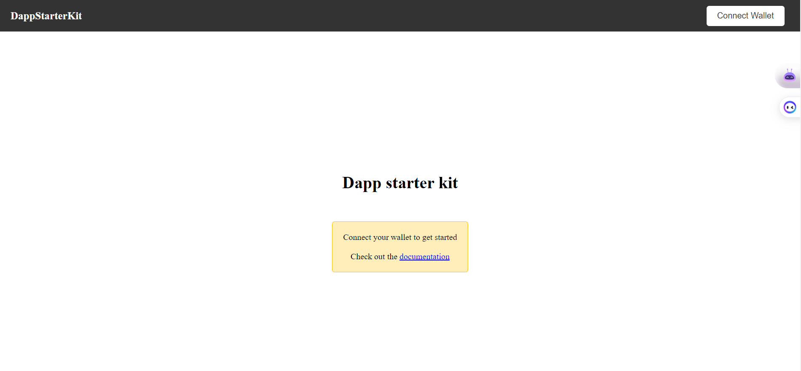
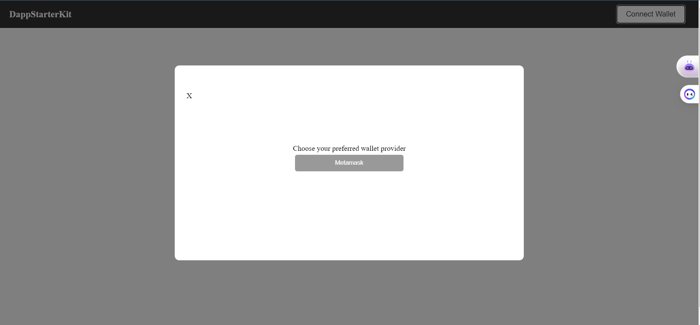
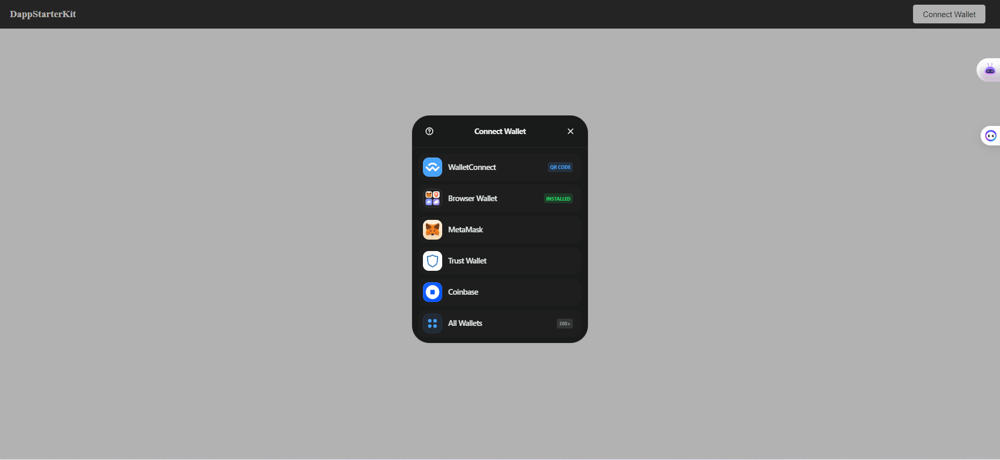
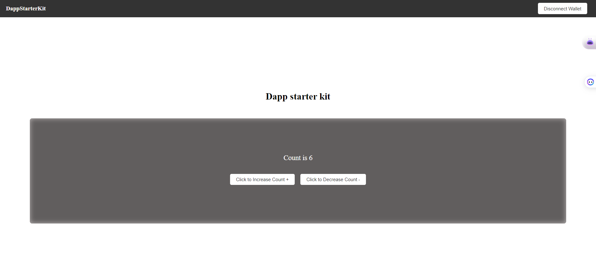

# dApp Starter Kit

Welcome! 

This is a starter kit for building decentralized applications (dApps) using Solidity smart contracts and React.js frontend. 

It provides a basic setup for building, testing, and deploying your dApp.

The starter kit includes a sample smart contract written in Solidity, a React.js frontend, and a Hardhat configuration for deploying to the Ethereum test networks (The sample contract is deployed in mumbai testnet). 

It also includes scripts for compiling, deploying, and testing your dApp.

Whether you're a beginner or an experienced developer, this starter kit provides a solid foundation for building your next dApp. Get started quickly with our easy-to-use setup, or customize it to fit your specific needs.

Happy coding!

# Getting started: 
There are 2 branches:
1. multi-wallet-support 
2. metamask-only 

`multi-wallet-support `: recommended when building large scalable dApps. Supports a number of wallets from coinbase, trust wallet, walletconnect, metamask e.t.c

`metamask-only`: recommended when doing smaller projects, only supports Metamask wallet

## Installation: 

Clone the repository:

`git clone https://github.com/Stephen-Kimoi/dApp-starter-kit.git` 

Depending on the type of project you are doing, checkout to the branch you'll be using

`git checkout metamask-only`  - for smaller projects 

`git checkout multi-wallet-support` - for large scalable dApps 

`npm install` 

`cd frontend` & `npm install` 

Once dependencies are installed run the following command:

`cp .env.example .env; `

Now add your alchemy api key i.e `ALCHEMY_API_KEY` and private key i.e `PRIVATE_KEY`

You can get your alchemy api key over [here](https://www.alchemyapi.io/) 
You can see how to get your private key over [here](https://support.metamask.io/hc/en-us/articles/360015289632-How-to-export-an-account-s-private-key)

Finally run: 

`npm run dev`  

This is the UI you'l see: 


<!-- Link to demo: 
https://www.loom.com/share/512ac2e1e464495b903f8c49573f2ce9 -->

Sample contract is found in `contracts/Counter.sol`

The deploy script is found in `scripts/deploy.js` 

### NB: You do not need to manualy copy paste the contract ABI and address when you run the deploy script, the `saveFrontendFiles` function inside the `deploy.js` script automatically creates a folder named `contracts` inside the `frontend/src` directory which contains: 
```
├── contracts/ 
    ├── contract-address.json - contains contract address 
    ├── Contract.json - contains contract ABI
``` 

The command for running the deploy script is: 
`npm run deployTestnet` (check out package.json in the main directory)

This command deploys the contract to `mumbai testnet` 

If you want to test the smart contract locally without having to deploy it: 
1. Run `npx hardhat node` for starting the hardhat node network. 
2. Run `npm run deployLocal` deploys contract to local hardhat network that you've just started. 

## Site description 

When you run `npm run dev` this is the site that you'll see: 


Click on the `connect wallet` button and this pop-up will appear: 

For metamask-only branch: 


For mutli wallet branch: 



Once you connet your wallet succesfully this is what you'll see (For both branches): 


You can now start editing it to suit the project you're doing

### NB: The contract is deployed in `mumbai testnet`, therefore ensure you've switched to mumbai testnet and have some `mumbai matic` to prevent any errors. 

## Functions description:

### Wallet Connection: 
We are using `Ether js` to connect to our wallets. 

Function for connecting wallet can be found in the `frontend/src/ConnectWallet/ConnectWallet.js` directory


``` 
├── frontend/ 
│    ... 
│    └── src/ 
│    ... 
│       ├── ConnectWallet/ 
│           ├── ConnectWallet.js 
``` 

The wallet provider that has been configured in the project is `Metamask`

### Navbar.jsx 
The file can be located in the `frontend/src/components/Navbar/Navbar.jsx` 

File path: 
``` 
├── frontend/ 
│    ... 
│    └── src/ 
│    ... 
│       ├── components/ 
│           ...
│           ├── Navbar
|               ├── Navbar.jsx
``` 
When you click the `connectWallet` button, a modal pop-up containing button for connecting to Metamask

Once you've connected your wallet, 2 buttons appear: 
1. Disconnect - for disconnecting the wallet 
2. Sliced address - contains address of the connected wallet

### ConnectWalletModal.jsx 
This is where the wallet connection takes place. 

The main function for connecting the wallet can be found within the `handleMetamaskSignUp` function.  

The `renderConnectors` function on line 47 displays the Metamask wallet connector button.  

Once the wallet is connected, the `Header` component appears. 

### Header.jsx 
This is where we call and perform actions to the deployed smart contract. 

We first import the `contractInstance` from the `frontend/src/ContractInstance/ContractInstance` directory. 

```
import contractInstance from '../../ContractInstance/ContractInstance';
```

We are performing the contract write operation normally using ethers js

We call the `set` function from the `simpleStorgae` contract instance gotten from the `contractInstance` import. 


